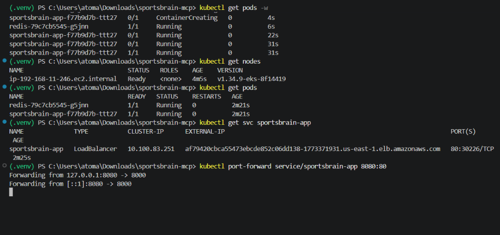
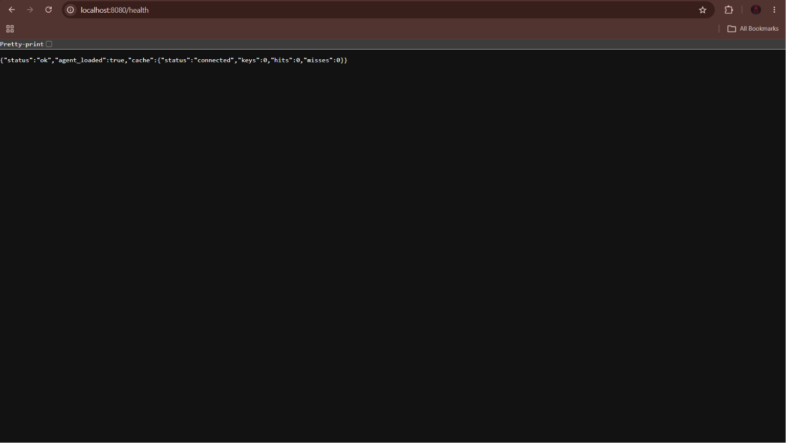
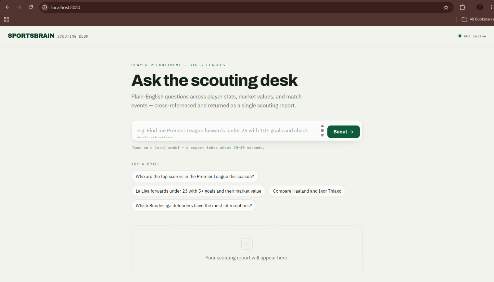

## Deployment (AWS EKS + CI/CD)

The app is containerized and deployed to a Kubernetes cluster on AWS EKS, with a
GitHub Actions pipeline defined for build-and-rollout.

### Cloud architecture

```
GitHub Actions ──build──> Docker image ──push──> Amazon ECR
                                                     │
                                                     ▼
                                          AWS EKS (t3.medium node)
                                          ├─ sportsbrain-app Deployment  (FastAPI + agent)
                                          │    └─ LoadBalancer Service (public, :80 -> :8000)
                                          └─ redis Deployment
                                               └─ ClusterIP Service (redis:6379)
                        config via ConfigMap · LangSmith key via Secret (secretKeyRef)
```

### Kubernetes manifests (`k8s/`)

| File              | Purpose                                                         |
| ----------------- | --------------------------------------------------------------- |
| `deployment.yaml` | App + Redis Deployments, with startup/readiness/liveness probes |
| `service.yaml`    | LoadBalancer (app) + ClusterIP (redis)                          |
| `configmap.yaml`  | Non-secret env (Redis URL, model, tracing flags)                |
| `secret.yaml`     | LangSmith key, injected into the app via `secretKeyRef`         |

### Deploy commands

```bash
# Build and push the image to ECR
docker build -t sportsbrain .
aws ecr create-repository --repository-name sportsbrain --region us-east-1
aws ecr get-login-password --region us-east-1 | docker login --username AWS --password-stdin <account>.dkr.ecr.us-east-1.amazonaws.com
docker tag sportsbrain:latest <account>.dkr.ecr.us-east-1.amazonaws.com/sportsbrain:latest
docker push <account>.dkr.ecr.us-east-1.amazonaws.com/sportsbrain:latest

# Create the cluster and deploy
eksctl create cluster --name sportsbrain --region us-east-1 --nodes 1 --node-type t3.medium --managed
kubectl apply -f k8s/
kubectl get pods

# Tear down (delete Services first so the ELB is removed cleanly)
kubectl delete -f k8s/
eksctl delete cluster --name sportsbrain --region us-east-1
```

### Deployment proof

The app was deployed to EKS and verified, then torn down to avoid ongoing cost.

<!-- Add your screenshots to a docs/ folder and update the paths below -->





Notes:

- **Inference backend.** The agent runs Qwen3 8B via Ollama, which needs a GPU.
  The t3.medium node is CPU-only, so the cluster deployment demonstrates the app
  serving (`/health`, UI, Redis connectivity) on Kubernetes; running live queries
  (`/query`) requires pointing `OLLAMA_BASE_URL` at a GPU/cloud LLM backend.
- **CI/CD.** `.github/workflows/deploy.yml` defines the full build → ECR → EKS
  rollout pipeline. It is set to manual dispatch (`workflow_dispatch`) as a
  demonstration; the header comment documents how to make it live.
